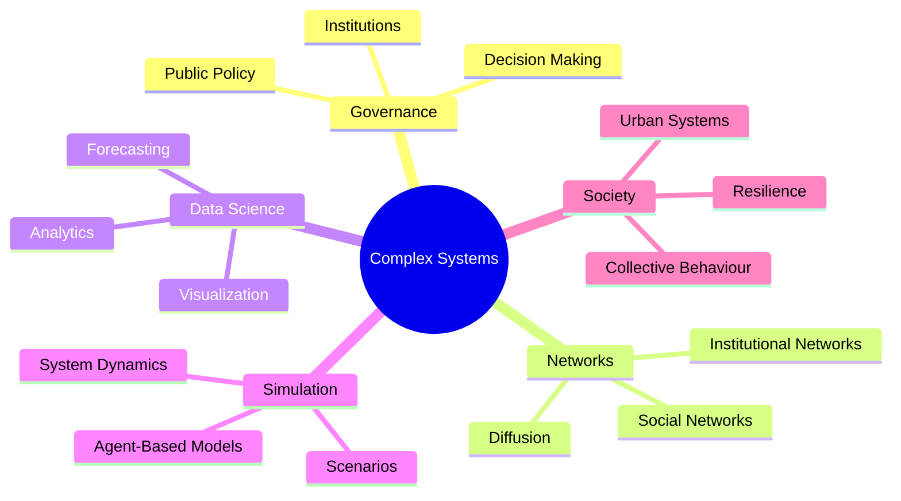

<div align="center">

# 🌸 DARIA'S SYSTEMS LAB

### Complex Systems • Governance • Networks • Data


<br>

*Exploring how data, institutions and networks shape collective decisions.*

</div>

---

## 🌷 About

Hi, I'm **Daria**.

I study complex social systems and the ways decisions emerge within them.

My interests lie at the intersection of:

🏛 **Public Policy & Governance**

📊 **Data Analysis**

🕸 **Network Science**

🤖 **Agent-Based Modeling**

🌍 **Complex Adaptive Systems**

I am particularly interested in how computational methods can help understand, evaluate and improve public decision-making under uncertainty.

---

## 🌸 Research Landscape



---

## 🔬 Research Dashboard

```text
Agent-Based Modeling         ███████░░░

Network Analysis             ████████░░

Policy Evaluation            ██████░░░░

Data Science                 ████████░░

Computational Social Science ███████░░░

Governance Research          ███████░░░
```

---

## ❓ Questions I'm Exploring

* How can agent-based models support policy design?
* What makes governance systems adaptive and resilient?
* How do institutional networks influence policy outcomes?
* How can data reduce uncertainty in public decision-making?
* What happens when interventions interact with complex social systems?

---

## 🛠 Methods & Tools

<p align="center">


</p>

---

## 🌱 Future Research

### 🏛 Policy Simulation

Using computational models to explore policy interventions and their consequences.

### 🕸 Governance Networks

Understanding how institutional structures influence collective outcomes.

### 📊 Evidence-Based Policy

Supporting public decisions through data and analytical methods.

### 🌍 Complex Adaptive Systems

Studying how societies respond to shocks, incentives and change.

---

## 📂 Featured Projects

Coming soon 🌸

This space will host projects related to:

* Agent-based modeling
* Network analysis
* Governance systems
* Public policy
* Data science
* Computational social science

---

## 📈 GitHub Activity

<div align="center">


</div>

---

## 🐍 Contribution Network


---

## 🌷 Connect

💼 LinkedIn

📧 Email

🌐 Personal Website

---

<div align="center">

### ✨ Understanding complex systems to design better policies.

🌸

</div>
