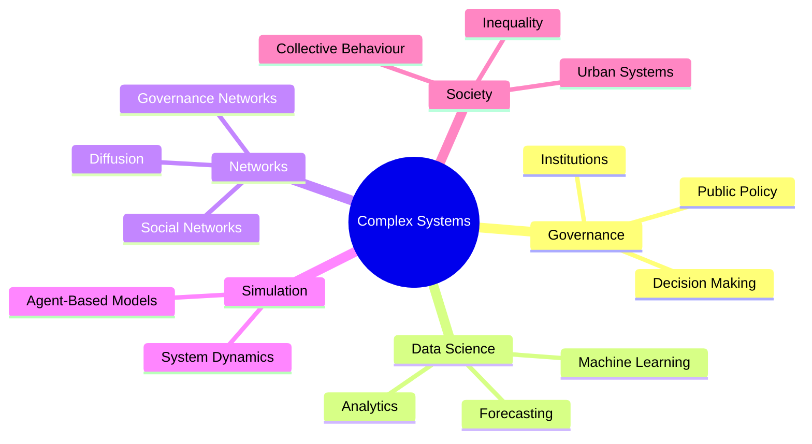

 

# 🌸 Hi, I'm Maria

### Complex Systems • Governance • Data Science

*Studying how data, networks and institutions shape collective decisions.*

---

## 🌷 About

I am a master's student interested in the intersection of:

🏛 Public Policy

📊 Data Analytics

🕸 Network Science

🤖 Agent-Based Modeling

🌍 Complex Adaptive Systems

My goal is to understand how complex social systems evolve and how better public decisions can be designed through evidence, simulation and computational methods.

---

## 🌸 Research Map

---

## 🔬 Current Focus

| Area                         | Status    |
| ---------------------------- | --------- |
| Agent-Based Modeling         | 🟣🟣🟣🟣⚪ |
| Network Analysis             | 🟣🟣🟣🟣⚪ |
| Policy Evaluation            | 🟣🟣🟣⚪⚪  |
| Data Science                 | 🟣🟣🟣🟣⚪ |
| Computational Social Science | 🟣🟣🟣⚪⚪  |

---

## 🌱 Future Research Directions

### 🏛 Policy Simulation

How can computational models improve public decision-making?

### 🕸 Governance Networks

How do institutional networks shape policy outcomes?

### 📊 Evidence-Based Policy

How can data support government decisions under uncertainty?

### 🌍 Complex Adaptive Systems

How do societies react to interventions and shocks?

---

## 🛠 Methods & Tools

---

## 📚 Currently Learning

* Agent-Based Modeling
* Computational Social Science
* Network Analysis
* Public Governance
* Data Visualization
* Causal Inference

---

## 📂 Featured Work

Coming soon 🌸

Current projects and research repositories will appear here.

---

## 📈 GitHub Activity

---

## 🐍 Contribution Snake

---

## 🌷 Connect

📫 LinkedIn

🌐 Personal Website

📧 Email

---

*"Understanding complex systems to design better policies."*

🌸

